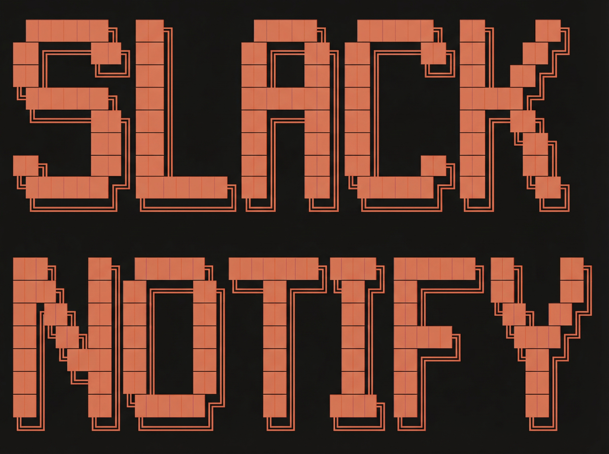

<p align="center">
  
</p>

# Claude Slack Notify

Slack notifications for Claude Code with clickable buttons to focus terminals and send commands.

**Get notified when Claude needs input. Break free from your terminal.** 

This adds Slack notifications so you can step away while Claude works - get pinged when it needs input, click to jump back, or respond directly from Slack (even on mobile).

## Features

- **Multi-instance support**: Run multiple Claude sessions with unique names
- **Clickable focus buttons**: One click switches to the exact terminal tab
- **Mobile support**: Respond to Claude from your phone via Slack buttons
- **Time-based notifications**: Only notifies for tasks taking >30 seconds
- **Cross-platform**: macOS, Windows, Linux, and remote SSH

## Quick Start

```bash
./install.sh
```

The installer guides you through creating a Slack app, configuring webhooks, and setting up button actions.

Then start the tunnel (in a separate terminal or background):

```bash
slack-tunnel              # Foreground (see status)
slack-tunnel --background # Background (for convenience)
```

And in Claude Code:

```
/slack-notify
```

> **Note**: The tunnel auto-terminates after 1 hour of inactivity. Run `slack-tunnel --background` to restart it.

## Platform Support

| Platform | Focus | Actions | Notes |
|----------|-------|---------|-------|
| macOS | Yes | Yes (with tmux) | iTerm2 or Terminal.app |
| Windows | Yes | Yes (WSL + tmux) | Requires registry setup |
| Linux | Yes | Yes (with tmux) | X11/Wayland required |
| Docker | No | No | Notifications only |
| Remote SSH | Yes | Yes (with tmux) | SSH key auth required |

## Remote SSH Sessions

Focus your local terminal while sending input to a remote Claude session.

### Setup

**On your Mac** (full install):
```bash
./install.sh
```

**On the remote server** (notifications only - no tunnel needed):
```bash
git clone https://github.com/anthropics/claude-slack-notify.git
cd claude-slack-notify
./install.sh
```

The remote install skips tunnel setup since the tunnel runs on your local Mac.

### Usage

```bash
# On your Mac:
slack-tunnel                                  # Start tunnel (keep running)

# In another terminal:
claude-slack-notify link --host user@server  # Creates link, SSHs, starts tmux
claude                                        # Start Claude on remote
/slack-notify                                 # Register in Slack
```

**Requirements**: macOS locally, tmux on remote, SSH key authentication.

### JupyterLab

```bash
# On your Mac (keep running):
slack-tunnel

# From another Mac terminal (with JupyterLab open in Chrome):
claude-slack-notify link --jupyter --host user@jupyter-server

# In JupyterLab terminal:
source ~/.claude/jupyter-env && tmux new -s claude
claude
/slack-notify
```

## Configuration

### Slack Buttons

Configure action buttons in `~/.claude/button-config`:

```
1|1
2|2
Continue|continue
Push|push
```

Format: `LABEL|ACTION` per line. Reconfigure with `./install.sh --configure`.

### Environment Variables

| Variable | Default | Description |
|----------|---------|-------------|
| `CLAUDE_NOTIFY_MIN_SECONDS` | 30 | Minimum task duration before notifying |
| `SLACK_WEBHOOK_URL` | - | Alternative to ~/.claude/slack-webhook-url |
| `CLAUDE_SSH_PORT` | 22 | SSH port for remote sessions |

## Commands

### Claude Code

```
/slack-notify           # Register session and start tunnel
/slack-notify MyProject # Register with custom name
/slack-notify stop      # Stop the tunnel and MCP server
```

### Terminal

```bash
./install.sh              # Install
./install.sh --uninstall  # Uninstall completely
./install.sh --configure  # Reconfigure buttons
./install.sh --link       # Install with symlinks (development)
slack-tunnel              # Start tunnel (foreground)
slack-tunnel --background # Start tunnel (background)
slack-tunnel --stop       # Stop tunnel
slack-tunnel --status     # Check tunnel status
```

## Debugging

```bash
tail -f ~/.claude/mcp-server.log  # MCP server logs
```

## macOS Permissions

On first Focus button click, grant automation permission when prompted. If denied, enable in **System Settings > Privacy & Security > Automation** for ClaudeFocus.app.

## License

MIT
